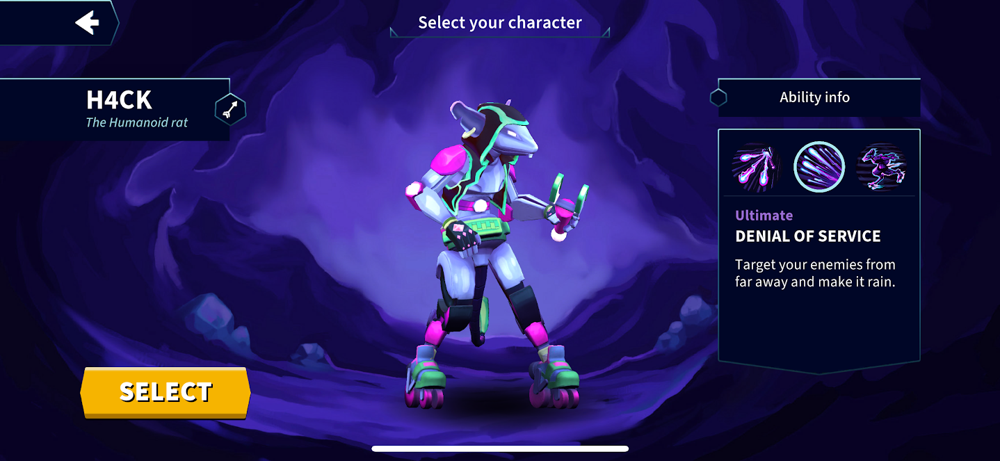
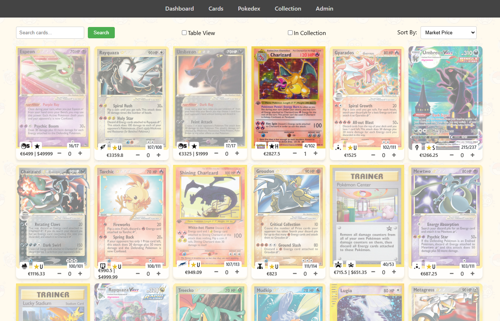
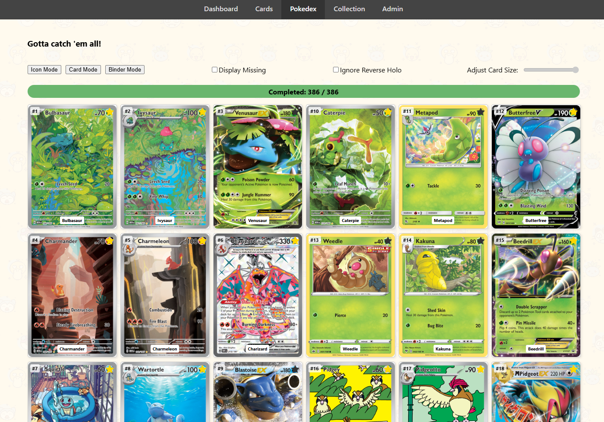

<!--
**marco-paulucci/marco-paulucci** is a ✨ _special_ ✨ repository because its `README.md` (this file) appears on your GitHub profile.

Here are some ideas to get you started:

- 🔭 I’m currently working on ...
- 🌱 I’m currently learning ...
- 👯 I’m looking to collaborate on ...
- 🤔 I’m looking for help with ...
- 💬 Ask me about ...
- 📫 How to reach me: ...
- 😄 Pronouns: ...
- ⚡ Fun fact: ...
-->

### 🎮 Game Dev Projects 🎮

  
Median XL (Released)

---
  
  Developed and conducted the largest Diablo II mod between 2012 and 2024. I've taken a hiatus since to focus on other projects. This full-conversion ARPG mod provides endless hours of entertainment, deep endgame, and a multiplayer network all over the world with an active trading scene.
    
  
  https://median-xl.com/

---

  
Champions of Mirra (Alpha)

---

  A fast-paced multiplayer brawler for mobile. It features many characters with unique skillsets, multiple game-modes, progression and more. It is developed using [lambdaclass' game backend](https://github.com/lambdaclass/mirra_backend). Developed by LambdaClass.
  

    
  https://championsofmirra.com/

---

  
TCGTracker (Alpha)

---
  Online web-app to track pokemon TCG cards. Existing trackers did not have certain features that I wanted.
  - Defining custom collections and galleries and seeing them as if they're in your binder.
  - A built-in Pokedex collection which features the most valuable (or your favorite) card for each slot.
  - Seeing your collection as a portfolio and price evolution of your cards/collections.
  - One-click access to find deals for cards you want on cardmarket, tcgplayer or ebay.

I made the project for personal use but I might go the extra mile one day to release it into production.

    
    

---

  
Kenzu (Pre-Alpha)

---
  
  Upcoming 2D action-packed platformer for PC and consoles. Developed by LambdaClass.

---

  
Other

---

  **Epic Warriors** (Prototype)
    
MMO Idle RPG/Autobattler developed using Unity and C# backend. It contains basic currencies, online battling, campaign and hero management. The goal of the game was a focus on F2P and "seasons" with much faster progress that resets monthly. [1](src/4.png), [2](src/5.png)

---
  
  **Black Realm** (Prototype)
    
A prototype made in Unreal Engine 5 based on Median XL mod for Diablo II. The goal was to dive into UE5 development and become familiar with the tech. It supports multiplayer, and integrates Fortnite's GameplayAbilitySystem. [Video](https://www.youtube.com/watch?v=mAKI9IiZJ1A) (note: the video contains 3rd party assets not owned by me).

---
  
**Insect Empire** (Prototype)
    
  A prototype of a game where in each level you have an Insectarium. The goal is to beat waves of enemies, bosses and environmental hazards with a horde of your insects. You have various different insects to buy, but you want to balance defense and economy. It's a mix of a clicker/collector and tower defense game. You also have a separate level-agnostic Insectarium (slower to build) with various perks and progression. 

---

  **Click, Boom, Repeat** (Prototype)
    
  A fast-paced action rogue-lite for PC/console where you unleash a variety of spells against endless waves of enemies. Early phase.

---

  **Kaline** (Prototype)
    
  Idle-RPG / autobattler prototype developed by LambdaClass.
  https://github.com/lambdaclass/afk_gacha_game

---
  
  **FlowTrip** (EoL)
    
  Mobile side-scroller developed in 2016 that lived a few years in the Apple Store until it became incompatible. Minimalistic graphics with interesting procedural patterns. It featured much gamification, including leaderboards, skins, trails, and media sharing.

---
  

